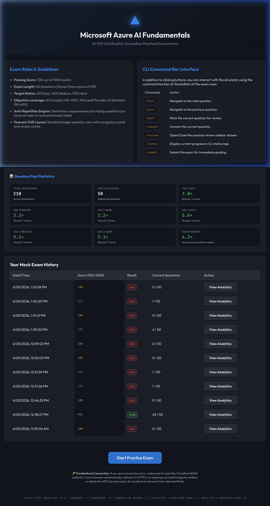
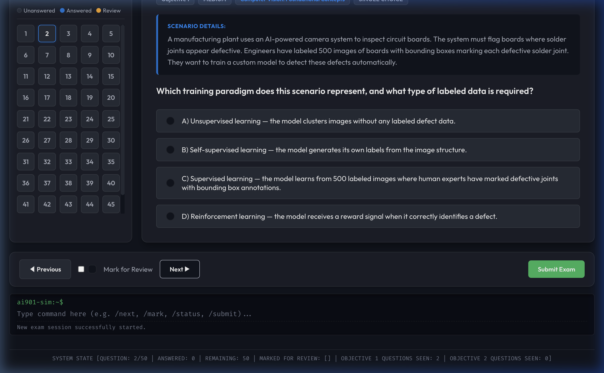
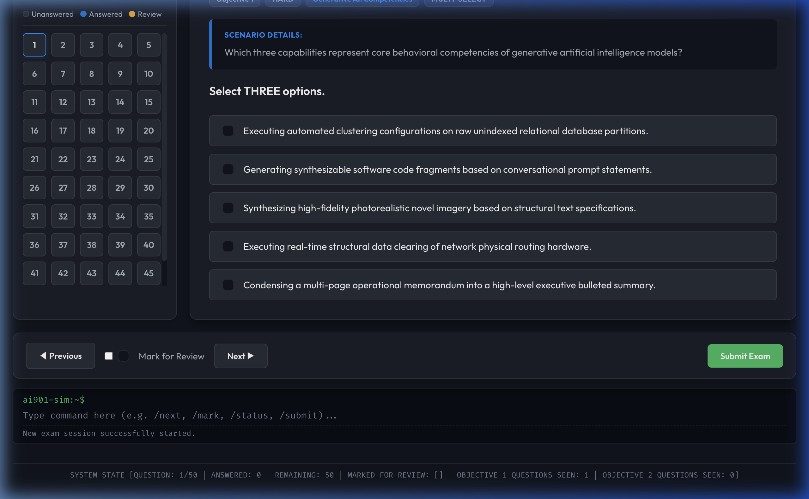
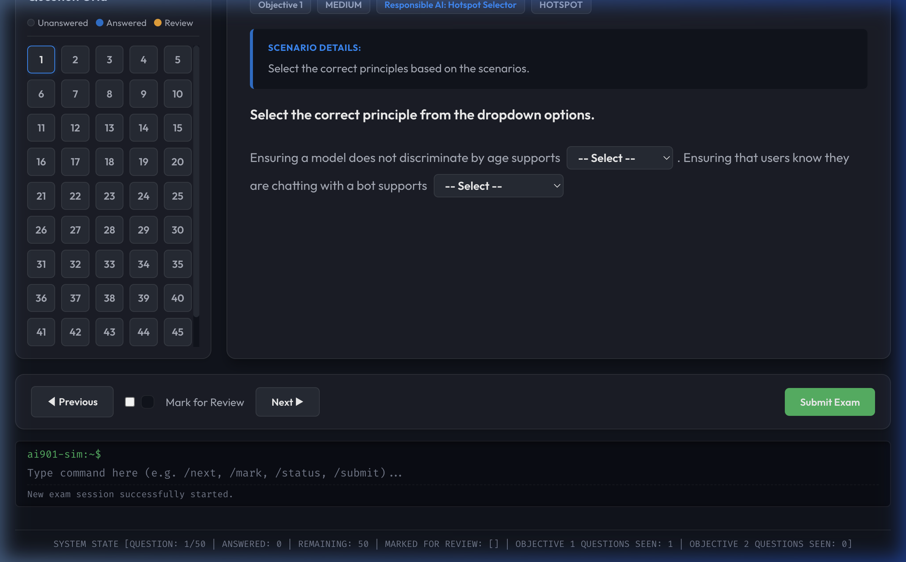
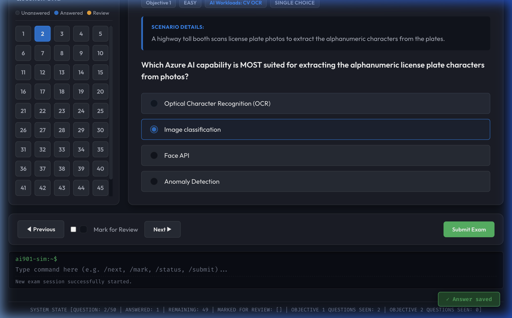
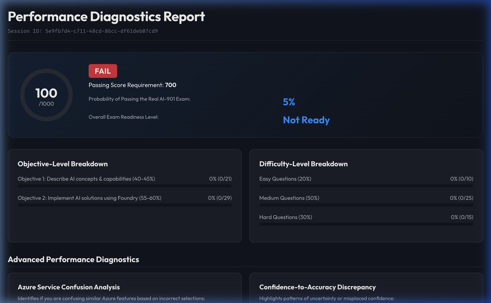
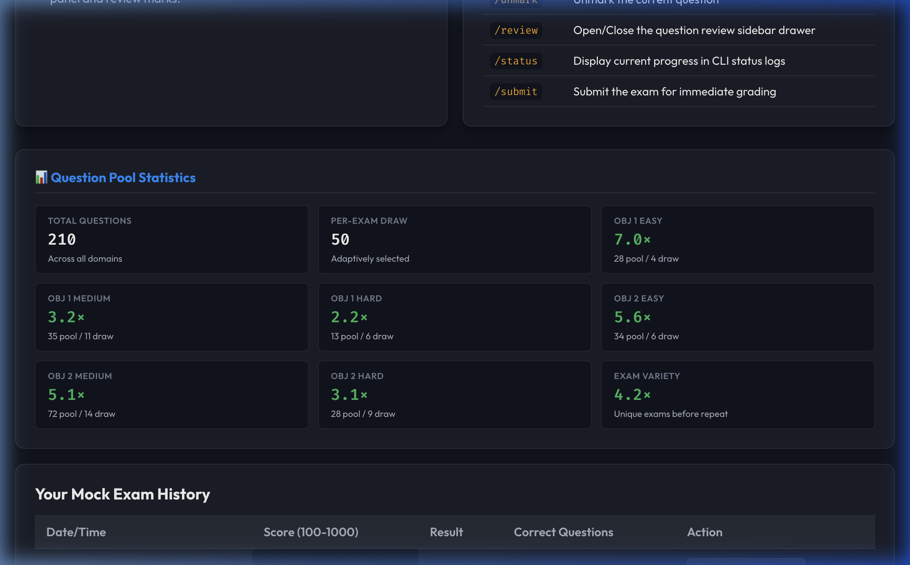

<div align="center">


<br/><br/>

# 🧠 AI-901 Ultimate Exam Simulator

### Microsoft Azure AI Fundamentals — Full-Fidelity Practice Environment

**A blueprint-aligned, Pearson VUE-style exam simulator with adaptive question selection,  
5 question types, and a deep performance analytics engine. Built entirely with vanilla web tech and Python stdlib — zero npm, zero pip.**

<br/>



<br/>

[✨ Features](#-features) · [🚀 Quick Start](#-quick-start) · [🏗 Architecture](#-architecture) · [📚 Question Bank](#-question-bank) · [📊 Analytics Engine](#-analytics-engine) · [⌨️ Controls](#️-controls-reference) · [🤝 Contributing](#-contributing)

</div>

---

## ✨ Features

### 🎯 Exam Engine
| Feature | Detail |
|:---|:---|
| **Blueprint-accurate** | Strictly follows official AI-901 skill measurement areas (Objective 1: 40–45%, Objective 2: 55–60%) |
| **Adaptive selection** | Anti-repetition engine prioritises questions you've never seen, then questions you previously failed |
| **Difficulty targeting** | Each exam draws 20% Easy · 50% Medium · 30% Hard across both objectives |
| **210-question pool** | Up to 4.2× unique exams before any repeat |
| **50-question sessions** | Matches the real exam format |
| **Persistent sessions** | Answers auto-saved to SQLite on every selection — resume-safe |

### 📝 Five Question Types
Mirrors the full variety found on Pearson VUE:

| Type | Count | What it tests |
|:---|:---:|:---|
| **Single Choice** | 172 | Standard A/B/C/D selection |
| **Multi-Select** | 5 | Choose 2–3 correct options (select-all-that-apply) |
| **True / False Matrix** | 13 | Per-statement T/F across a scenario table |
| **Dropdown Hotspot** | 11 | Fill-in-the-blank dropdowns in a sentence |
| **Drag & Drop** | 9 | Match models/services to target slots |

### 📊 Performance Analytics
After each submission the simulator produces a full diagnostic report:

- **Score gauge** (100–1000 scale) with PASS / FAIL badge at the 700 threshold
- **Passing probability** modeled against real exam difficulty
- **Per-objective breakdown** with progress bars (Objective 1 vs 2)
- **Per-difficulty breakdown** (Easy / Medium / Hard)
- **Azure Service Confusion Analysis** — catches common service mix-ups (e.g. CLU vs QnA vs LUIS)
- **Confidence-to-Accuracy Discrepancy** — flags questions where your stated confidence didn't match your answer
- **Readiness matrix** per topic with risk tags (Low / Medium / High)
- **Personalised 3-day study roadmap** with prioritised topics
- **Microsoft Learn deep links** — direct clickable links to official learning paths for every weak area
- **Question-by-question review** — filterable by Correct / Incorrect / Uncertain, showing full scenario + your answer vs correct answer + explanation

### 🖥 Pearson VUE-Style Interface
- Dark-mode dashboard with real-time session stats
- Split-panel exam layout: question grid sidebar + full workspace
- Question type badge on every question
- Timer with red-pulsing critical warning at 50 minutes
- Mark-for-Review toggle with amber grid indicators
- Auto-save toast notification on every answer change
- CLI command bar for power users (`/next`, `/prev`, `/mark`, `/status`, `/submit`)
- ⌨️ Keyboard hotkeys: `A–D` or `1–4` to select options; `←` `→` to navigate questions

---

## 📸 Screenshots

<details>
<summary><strong>📋 Full Dashboard</strong> — click to expand</summary>
<br/>


> The landing page shows exam rules, CLI command reference, the live question pool statistics widget (saturation ratios per difficulty/objective), and your full attempt history with View Analytics links.

</details>

<details>
<summary><strong>🔘 Single Choice Question</strong> — click to expand</summary>
<br/>



> The exam workspace shows the 4-badge meta header (Objective · Difficulty · Topic · **Question Type**), a highlighted scenario card, the question stem, and radio-button answer options. The question grid sidebar shows answered (blue) and marked (amber) questions at a glance.

</details>

<details>
<summary><strong>☑️ Multi-Select Question</strong> — click to expand</summary>
<br/>



> Multi-select questions clearly state the required number of selections ("Select THREE options."). Checkboxes replace radio buttons automatically based on question type.

</details>

<details>
<summary><strong>🔽 Hotspot / Dropdown Question</strong> — click to expand</summary>
<br/>



> Dropdown Hotspot questions embed interactive `<select>` elements directly inline within scenario sentences — matching the real Pearson VUE hotspot format.

</details>

<details>
<summary><strong>💾 Auto-Save Toast</strong> — click to expand</summary>
<br/>



> Every answer change triggers a green "✓ Answer saved" toast notification in the bottom-right corner, confirming the answer was persisted to the SQLite database.

</details>

<details>
<summary><strong>📊 Performance Diagnostics Report</strong> — click to expand</summary>
<br/>



> The full-page analytics report shows the score gauge, PASS/FAIL verdict, objective and difficulty breakdowns, Azure service confusion analysis, and a personalised study roadmap.

</details>

<details>
<summary><strong>📊 Question Pool Statistics Widget</strong> — click to expand</summary>
<br/>



> The dashboard pool stats widget shows real-time saturation ratios for every difficulty/objective bucket, so you can see how many unique exams are possible before any repeat.

</details>

---

## 🚀 Quick Start

### Prerequisites

- **Python 3.8+** (uses only stdlib — no `pip install` needed)
- A modern web browser (Chrome, Firefox, Edge)

### 1. Clone the repository

```bash
git clone https://github.com/YOUR_USERNAME/ai901-exam-simulator.git
cd ai901-exam-simulator
```

### 2. Start the server

```bash
python3 server.py
```

On first run, the server seeds the SQLite database from `database.py` (210 questions). This takes **5–15 seconds** — you'll see the startup message once it's ready.

> ℹ️ On subsequent runs the database already exists and the server starts instantly.

### 3. Open in browser

```
http://localhost:8000
```

> ⚠️ **Important:** Type the URL with `http://` explicitly. Some browsers redirect `localhost` to HTTPS which will block the connection. If you get a connection error, try an incognito window or visit `chrome://net-internals/#hsts` to clear the HSTS policy for localhost.

---

## 🔧 Troubleshooting

| Problem | Cause | Fix |
|:---|:---|:---|
| Browser shows "This site can't be reached" | Browser HTTPS redirect | Type `http://localhost:8000` explicitly; clear HSTS via `chrome://net-internals/#hsts` |
| `Address already in use` on startup | Port 8000 is occupied | Kill the existing process: `lsof -ti:8000 \| xargs kill -9` |
| Server hangs on first start | DB is seeding 210 questions | Wait 5–15 seconds; only happens once |
| `python3: command not found` | Python not installed or wrong alias | Try `python server.py`; ensure Python 3.8+ is installed |
| Drag & Drop items won't snap | Stale browser cache | Hard-reload with `Cmd+Shift+R` (Mac) or `Ctrl+Shift+R` (Windows) |
| Missing exam history after restart | DB in `.gitignore` | This is expected — `ai901_simulator.db` is excluded from git to protect personal data |

---

## 🏗 Architecture

This project is intentionally dependency-free. Everything runs on Python's standard library and vanilla browser APIs.

```
ai901-exam-simulator/
├── server.py          # Pure Python stdlib HTTP + REST API server (no Flask/FastAPI)
├── database.py        # SQLite schema + 210 questions with full metadata
├── index.html         # Single-page app shell
├── app.js             # All client logic (~1,500 lines, vanilla JS)
├── styles.css         # All styling (~1,800 lines, vanilla CSS custom properties)
├── ai901_simulator.db # Auto-generated SQLite database on first run
├── verify_db.py       # Optional: DB health-check and stats script
└── docs/
    └── screenshots/   # README screenshots
```

### How It Works

```
Browser (SPA)          Python Server           SQLite DB
─────────────          ─────────────           ─────────
index.html        ←─── static files ───        
app.js            ──── POST /api/exam/start ──► SELECT 50 adaptive questions
                  ◄─── {session_id, questions}
                  
                  ──── POST /api/exam/answer ─► INSERT/UPDATE answer row
                  ◄─── 200 OK (background sync)
                  
                  ──── POST /api/exam/submit ─► grade all answers, compute score
                  ◄─── full analytics JSON       INSERT exam_history row
                  
                  ──── GET /api/history ──────► SELECT all past attempts
                  ◄─── [{session_id, score, ...}]
```

### API Endpoints

| Method | Path | Purpose |
|:---|:---|:---|
| `GET` | `/api/history` | Returns all past exam sessions |
| `POST` | `/api/exam/start` | Starts a new session, returns 50 adaptive questions |
| `POST` | `/api/exam/answer` | Saves a single answer (called on every selection) |
| `POST` | `/api/exam/submit` | Grades the session and returns the full analytics report |

---

## 📚 Question Bank

**210 questions** across 2 objectives, 3 difficulty levels, and 5 question types — all authored to Microsoft's Pearson VUE style guide: scenario-first stems, plausible distractors, and Bloom's Taxonomy Level 3+ cognitive depth.

### Pool Distribution

| | Easy | Medium | Hard | Total |
|:---|:---:|:---:|:---:|:---:|
| **Objective 1** — AI Concepts & Capabilities (40–45%) | 28 | 35 | 13 | **76** |
| **Objective 2** — Azure Foundry AI Solutions (55–60%) | 34 | 72 | 28 | **134** |
| **Total** | **62** | **107** | **41** | **210** |

### Pool Saturation (per-exam draw vs pool size)

| Bucket | Pool | Draw | Saturation |
|:---|:---:|:---:|:---:|
| Obj 1 Easy | 28 | 4 | 7.0× |
| Obj 1 Medium | 35 | 11 | 3.2× |
| Obj 1 Hard | 13 | 6 | 2.2× |
| Obj 2 Easy | 34 | 6 | 5.6× |
| Obj 2 Medium | 72 | 14 | 5.1× |
| Obj 2 Hard | 28 | 9 | 3.1× |
| **Overall variety** | 210 | 50 | **4.2×** |

> A saturation of 4.2× means you can take ~4 completely unique exams before any question repeats.

### Topics Covered (Objective 1)
- Fundamental AI Principles & Workload Types
- Responsible AI: Fairness, Reliability, Privacy, Security, Inclusiveness, Transparency, Accountability
- Deep Learning vs Traditional Machine Learning
- Generative AI: Hallucination, RLHF, alignment
- Prompt Engineering: temperature, top_p, context windows
- Computer Vision fundamentals (classification, detection, segmentation)
- Natural Language Processing fundamentals
- Conversational AI design principles

### Topics Covered (Objective 2)
- Azure AI Vision (OCR, object detection, face analysis)
- Azure AI Language (CLU, sentiment, NER, QnA Maker)
- Azure AI Speech (STT, TTS, speaker recognition)
- Azure AI Document Intelligence
- Azure AI Search (vector search, semantic ranking)
- Azure OpenAI Service (models, deployment, safety)
- Azure AI Foundry (Hub, Projects, prompt flow)
- Azure Machine Learning (AutoML, designer, pipelines)
- Responsible AI Dashboard & Fairlearn
- Azure AI Content Safety

---

## 📊 Analytics Engine

The grading engine produces a structured JSON report with 15+ computed fields:

```python
{
  "score":               901,          # 100–1000 Pearson VUE scale
  "status":             "PASS",        # PASS | FAIL (threshold: 700)
  "correct":             43,
  "total":               50,
  "passing_probability": 91,           # % chance of passing real exam
  "objective_breakdown": {
    "Objective 1": {"correct": 18, "total": 21, "pct": 86},
    "Objective 2": {"correct": 25, "total": 29, "pct": 86}
  },
  "difficulty_breakdown": { ... },
  "topic_weakness_map":  [ ... ],      # sorted by worst performance
  "confusion_pairs":     [ ... ],      # Azure service mis-attributions
  "confidence_anomalies":[ ... ],      # uncertain-correct / confident-incorrect
  "readiness_matrix":    [ ... ],      # per-topic risk: low | medium | high
  "learn_recommendations":[ ... ],     # Microsoft Learn path URLs
  "study_roadmap":       { ... }       # 3-day plan
}
```

### Score Calculation

The simulator uses a difficulty-weighted scoring approximation:
- Minimum score: **100** (all wrong)
- Passing score: **700** (≈70% weighted-correct)
- Maximum score: **1000** (all correct)

Hard questions earn 2.0× points, Medium 1.5×, Easy 1.0× — approximating how harder items contribute more to your score on the real exam.

---

## ⌨️ Controls Reference

### Keyboard Shortcuts (during exam)

| Key | Action |
|:---|:---|
| `A` / `1` | Select option A (first) |
| `B` / `2` | Select option B (second) |
| `C` / `3` | Select option C (third) |
| `D` / `4` | Select option D (fourth) |
| `→` Arrow Right | Next question |
| `←` Arrow Left | Previous question |
| `M` | Toggle Mark for Review |

> Hotkeys only activate when not typing in the CLI bar. `A-D` / `1-4` work only on Single Choice questions; `M` and arrow keys work on all types.

### CLI Command Bar

Type commands in the `ai901-sim:~$` terminal bar at the bottom of the exam view:

| Command | Action |
|:---|:---|
| `/next` | Navigate to next question |
| `/prev` | Navigate to previous question |
| `/mark` | Flag current question for review |
| `/unmark` | Remove review flag |
| `/review` | Toggle the question review sidebar |
| `/status` | Print current progress to CLI log |
| `/submit` | Open the submit confirmation dialog |

### Drag & Drop
- **Drag** an item from the "Model Options" bank onto a target slot
- **Drag between zones** — moving an item from one slot to another clears the source slot automatically
- **Double-click** a filled slot to return the item to the bank

---

## 🔧 Configuration

All configuration is at the top of `server.py`:

```python
PORT    = 8000          # Change the server port
DB_FILE = "ai901_simulator.db"  # SQLite database path
```

The exam draw parameters (50 questions, difficulty ratios, blueprint weights) are configured in the `select_exam_questions()` function in `server.py`.

---

## 🗃 Database Schema

The SQLite database (`ai901_simulator.db`) is auto-created on first run via `database.py`.

```sql
-- Questions pool
CREATE TABLE questions (
    id               TEXT PRIMARY KEY,   -- Q001, Q002, ...
    objective        TEXT,               -- "Objective 1" | "Objective 2"
    difficulty       TEXT,               -- "easy" | "medium" | "hard"
    topic            TEXT,
    type             TEXT,               -- "single-choice" | "multi-choice" | etc.
    scenario         TEXT,               -- optional scenario preamble
    question         TEXT,
    options          TEXT,               -- JSON
    correct_answer   TEXT,               -- JSON (string or array)
    explanations     TEXT,               -- JSON {correct, incorrect, concept}
    avg_time         INTEGER,            -- expected seconds
    confused_services TEXT               -- JSON array of commonly confused services
);

-- Per-session answers
CREATE TABLE exam_sessions (
    session_id       TEXT,
    question_id      TEXT,
    selected_answer  TEXT,               -- JSON
    time_spent       INTEGER,
    marked_for_review INTEGER,           -- 0 | 1
    is_correct       INTEGER,            -- 0 | 1 | NULL (pre-submit)
    confidence       TEXT
);

-- Graded attempt history
CREATE TABLE exam_history (
    session_id       TEXT PRIMARY KEY,
    timestamp        TEXT,
    score            INTEGER,
    status           TEXT,
    correct          INTEGER,
    total            INTEGER,
    report_json      TEXT                -- full analytics blob
);
```

---

## 🤝 Contributing

Contributions are very welcome! Here's how to help:

### Adding Questions

See [CONTRIBUTING.md](CONTRIBUTING.md) for the full schema reference covering all 5 question types with annotated examples.

Quick checklist:
   - Unique `id` (e.g., `Q211`)
   - Real-world scenario stem (not a generic "which service does X?" prompt)
   - Four plausible distractors with meaningful differences
   - Full `explanations` block: `correct`, `incorrect` per wrong option, and `concept`
   - Correct `objective`, `difficulty`, and `topic` classification
4. Run `python3 verify_db.py` to validate — look for `=== Validation Status: PASSED ===`
5. Submit a PR using the [PR template](.github/PULL_REQUEST_TEMPLATE.md)

### Reporting Issues

Please open a GitHub Issue with:
- The question ID (visible in the review card meta row)
- The incorrect answer or explanation
- A reference source (Microsoft Learn URL, exam guide, etc.)

### Roadmap Ideas

- [ ] Export wrong/uncertain questions to PDF study guide
- [ ] Timed mode with enforced 60-minute cutoff
- [ ] Azure SDK for Python code snippet questions (reading comprehension type)
- [ ] Multi-user support with login
- [ ] Spaced repetition scheduling for weak topics

---

## 📖 Disclaimer

> This simulator is an **unofficial** study tool created for educational purposes.  
> It is **not affiliated with, endorsed by, or certified by Microsoft Corporation**.  
> AI-901 (Exam: Microsoft Azure AI Fundamentals) is a real Microsoft certification exam — verify the latest blueprint at [aka.ms/AI901-StudyGuide](https://aka.ms/AI901-StudyGuide).  
> Azure, Microsoft Learn, and Pearson VUE are trademarks of their respective owners.  
> Always verify your knowledge against [official Microsoft Learn paths](https://learn.microsoft.com/en-us/credentials/certifications/exams/ai-901/) before sitting the real exam.

---

## 📄 License

MIT License — see [LICENSE](LICENSE) for details.

---

<div align="center">

**Built with ❤️ for AI learners — good luck on your AI-901!**

⭐ Star this repo if it helped you pass!

</div>
